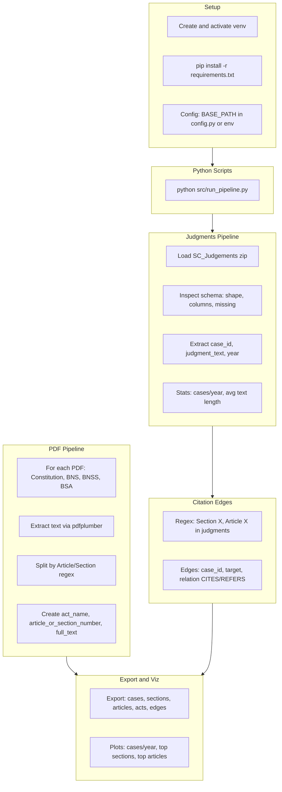

# Phase-1 Legal RAG Data Exploration and Preprocessing (Python Scripts)

## Context

The pipeline loads files from a **configurable Datasets path** (default: `Datasets/` in project root). Expected files:

- `SC_Judgements-16-25.zip` - Supreme Court judgments (2016-2025)
- `Constitution Of India.pdf` - Articles
- `1_BNS.pdf` - Bharatiya Nyaya Sanhita (sections)
- `2 Bharatiya nagrik Suraksha sanhita.pdf` - BNSS (sections)
- `3 Bharatiya Sakshya Adhiniyam.pdf` - BSA (sections)

All logic runs in a **local virtual environment** with dependencies installed only there. Implementation is **Python scripts (.py)**, not Colab notebooks.

---

## 1. Venv and Setup (First Step)

### 1.1 Create Virtual Environment

```powershell
python -m venv venv
venv\Scripts\activate
```

### 1.2 Create requirements.txt (project root)

```
pandas>=2.0.0
pdfplumber>=0.10.0
matplotlib>=3.7.0
```

### 1.3 Install Dependencies in Venv Only

```powershell
pip install -r requirements.txt
```

No global/system installs. All packages live inside `venv/`.

### 1.4 Run Pipeline (after implementation)

```powershell
cd c:\Users\ATHARV\LegalRAG
venv\Scripts\activate
python src/run_pipeline.py
```

---

## 2. Project Architecture




---

## Implementation Plan

### 3. Config and Project Layout

- `config.py`: `BASE_PATH` (default `Datasets/`), output path `phase1_output/`, file names for zip and PDFs
- Optional: `BASE_PATH` from env var `LEGALRAG_DATA_PATH` for override
- Directory layout: `src/` for modules, `scripts/` or root for entrypoint

### 4. Load and Inspect SC Judgments (zip)

- Unzip to temp dir or `BytesIO`, list contents to find CSV/Parquet
- Load first tabular file with `pd.read_csv()` (or `read_parquet` if applicable)
- **Schema inspection**:
  - `df.shape`, `df.columns`, `df.dtypes`
  - `df.isnull().sum()`, `df.head()`
- **Column mapping** (case-insensitive): Map to `case_id`, `judgment_text`, `year`
  - Likely candidates: `case_id`/`id`/`case_number`, `text`/`judgment`/`judgment_text`, `year`/`date`/`judgment_date`
  - Parse date to year if only date exists
- Keep only: `case_id`, `judgment_text`, `year`
- Assign stable `case_id` (e.g. `case_{i}`) if missing

### 5. Judgments Statistics and Basic Plot

- Cases per year: `df.groupby('year').size()`
- Avg text length: `df['judgment_text'].str.len().describe()`
- Plot: `plt.bar(years, counts)` – judgments per year (matplotlib only)

### 6. PDF Extraction (Constitution, BNS, BNSS, BSA)

Single reusable function per PDF type:

```python
def extract_structured_from_pdf(pdf_path, act_name, pattern_type='article'|'section'):
    # pdfplumber.open() -> extract text per page
    # Regex patterns:
    #   Article: r'Article\s+(\d+(?:\(\d+\))?)\s*[-–]\s*(.*?)(?=Article\s+\d|$)'
    #   Section: r'Section\s+(\d+(?:\(\d+\))?)\s*[-–:]\s*(.*?)(?=Section\s+\d|$)'
    # Build DataFrame: act_name, article_or_section_number, full_text
    return df
```

- **Constitution**: `pattern_type='article'`, act_name = "Constitution Of India"
- **BNS, BNSS, BSA**: `pattern_type='section'`, act names from filenames
- Combine into `articles_df` (Constitution) and `sections_df` (BNS, BNSS, BSA)
- Build `acts_df`: `act_name`, `act_type` (article/section), `source_file`

### 7. Build Acts / Sections / Articles Tables

- `acts.csv`: `act_id`, `act_name`, `act_type`, `source_file`
- `articles.csv`: `article_id`, `act_id`, `article_number`, `full_text` (from Constitution)
- `sections.csv`: `section_id`, `act_id`, `section_number`, `full_text` (from BNS, BNSS, BSA)

Normalize IDs for Neo4j: `article_id` = `"Constitution_Art_<num>"`, `section_id` = `"<Act>_Sec_<num>"`.

### 8. Citation Extraction from Judgments

- Regex to find references in `judgment_text`:
  - `Section X`: `r'Section\s+(\d+(?:\(\d+\))?)'`
  - `Article X`: `r'Article\s+(\d+(?:\(\d+\))?)'`
- **Relation heuristics**: Use "cite", "refer", "under" context; default `CITES` for explicit "Section X" / "Article X"
- Build `edges` DataFrame: `source_case_id`, `target_section_or_article`, `relation` (CITES / REFERS)
- Target format: `"Constitution_Art_14"`, `"BNS_Sec_302"`, etc., matching `articles.csv` and `sections.csv` IDs

### 9. Export Clean CSVs (Neo4j-Ready)

Save to `phase1_output/` (or configurable output dir):


| File           | Columns                                             |
| -------------- | --------------------------------------------------- |
| `cases.csv`    | case_id, judgment_text, year                        |
| `sections.csv` | section_id, act_id, section_number, full_text       |
| `articles.csv` | article_id, act_id, article_number, full_text       |
| `acts.csv`     | act_id, act_name, act_type, source_file             |
| `edges.csv`    | source_case_id, target_section_or_article, relation |


Use `df.to_csv(..., index=False)` for flat CSVs.

### 10. Visualization Plots (Matplotlib Only)

1. **Judgments per year** – bar chart (in judgments module)
2. **Top cited sections** – `edges[edges.target.str.contains('Sec')].value_counts().head(20).plot(kind='barh')`
3. **Top cited articles** – same for `Art`

---

## Key Design Decisions


| Decision                       | Rationale                                                 |
| ------------------------------ | --------------------------------------------------------- |
| Venv first, pip in venv only   | Isolated deps; no global pollution                        |
| Python scripts, not Colab      | Reproducible, versionable, runnable locally               |
| Configurable `BASE_PATH`       | User sets Datasets path via config or env                 |
| Schema inference for zip       | SC_Judgements schema may vary; inspect first, map columns |
| Single PDF extraction function | DRY; `pattern_type` toggles Article vs Section regex      |
| Relation = CITES/REFERS        | Simple binary for Phase-1; can refine later with NER      |
| No ML/embeddings/FAISS/Neo4j   | Phase-1 scope is data prep only                           |


---

## Regex Patterns (Indian Legal Conventions)

- **Article**: `Article\s+(\d+(?:\(\d+\))?)` – matches Article 14, Article 32(1)
- **Section**: `Section\s+(\d+(?:\(\d+\))?)` – matches Section 302, Section 41(1)
- Splitting: Use lookahead `(?=Article\s+\d|$)` to separate sections without consuming

---

## Files to Create


| File                   | Purpose                                                  |
| ---------------------- | -------------------------------------------------------- |
| `requirements.txt`     | pandas, pdfplumber, matplotlib                           |
| `config.py`            | BASE_PATH, output path, file names                       |
| `src/judgments.py`     | Load zip, inspect, extract case_id/judgment_text/year    |
| `src/pdf_extractor.py` | Extract Articles/Sections from PDFs via regex            |
| `src/edges.py`         | Extract Section/Article refs from judgments, build edges |
| `src/export.py`        | Export CSVs, save plots                                  |
| `src/run_pipeline.py`  | Entry point: orchestrate all steps                       |
| `src/__init__.py`      | Empty, for `src` package imports                         |
| `README.md`            | Venv setup + run instructions                            |


Style: Modular functions, docstrings, inline comments. All scripts run with `python -m` or `python src/run_pipeline.py` from project root with venv active.

---

## Dependencies (Venv)

- `pandas>=2.0.0`
- `pdfplumber>=0.10.0`
- `matplotlib>=3.7.0`
- `re`, `zipfile`, `io` – stdlib

