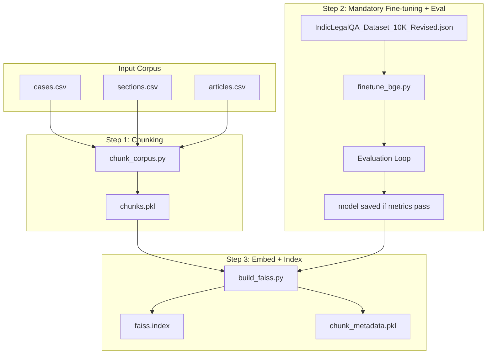

# Phase 3: Embeddings and Vector Retrieval Pipeline

## Scope (Strict)

- **In scope**: Chunking, mandatory fine-tuning with evaluation, embedding, FAISS index, metadata persistence
- **Out of scope**: LangGraph, Neo4j, UI, Ollama, RAG orchestration

## Architecture




---

## Data Sources


| Source   | Path                                                     | Key Columns | Text Column   |
| -------- | -------------------------------------------------------- | ----------- | ------------- |
| Cases    | [phase1_output/cases.csv](phase1_output/cases.csv)       | case_id     | judgment_text |
| Sections | [phase1_output/sections.csv](phase1_output/sections.csv) | section_id  | full_text     |
| Articles | [phase1_output/articles.csv](phase1_output/articles.csv) | article_id  | full_text     |


IndicLegalQA (required for fine-tuning): [Datasets/IndicLegalQA Dataset_10K_Revised.json](Datasets/IndicLegalQA Dataset_10K_Revised.json) — structure: `{case_name, judgement_date, question, answer}`

---

## Implementation Plan

### 1. Folder Structure

```
phase3_embeddings/
├── __init__.py
├── config.py           # Paths, chunk/token params, model names
├── chunk_corpus.py     # Chunk cases/sections/articles → chunks.pkl
├── finetune_bge.py     # Mandatory BGE fine-tuning + evaluation
├── build_faiss.py      # Embed chunks, build FAISS index
├── retrieve.py         # Simple retrieval API (embed query, search FAISS)
└── README.md           # Run instructions
```

### 2. Chunking Module (`chunk_corpus.py`)

- **Input**: CSVs from `phase1_output/` (configurable path)
- **Logic**:
  - Load each CSV, extract (id, text) pairs per source type
  - Use token-based chunking: ~500 tokens per chunk, ~100 token overlap (stride = 400)
  - Tokenizer: use `transformers.AutoTokenizer` with `BAAI/bge-small-en-v1.5` for consistency with embedding model
  - For very short texts (e.g. sections with a few words), keep as single chunk
- **Output**: `chunks.pkl` — list of dicts: `{chunk_id, source_type, source_id, text}`
  - `chunk_id`: unique (e.g. `case_0_chunk_0`, `BNS_Sec_147_chunk_0`)
  - `source_type`: `"case"`, `"section"`, or `"article"`
  - `source_id`: original ID (`case_id`, `section_id`, `article_id`)
  - `text`: chunk text

### 3. Mandatory Fine-Tuning + Evaluation (`finetune_bge.py`)

- **Base model**: `BAAI/bge-small-en-v1.5`
- **Task**: MultipleNegativesRankingLoss — (anchor=question, positive=answer) pairs from IndicLegalQA
- **Data split**: 80% train (8K pairs), 20% eval (2K pairs) — fixed random seed for reproducibility
- **Training pairs**: Each training record → `(question, answer)` as one positive pair
- **Evaluation**: Use `InformationRetrievalEvaluator` from SentenceTransformers
  - Eval setup: queries = eval questions, corpus = eval answers, relevant_docs = each question maps to its answer doc ID
  - Evaluator runs after each epoch during training (optional) and once at the end
- **Metrics** (target: satisfactory or above average):
  - **MRR@10** (Mean Reciprocal Rank): Satisfactory ≥ 0.50, Above-average ≥ 0.65
  - **NDCG@10** (Normalized Discounted Cumulative Gain): Satisfactory ≥ 0.55, Above-average ≥ 0.70
  - **Recall@10**: Satisfactory ≥ 0.60, Above-average ≥ 0.75
- **Baseline comparison**: Run eval on unfinetuned BGE before training; fine-tuned model must beat baseline
- **Output**: Model saved to `phase3_embeddings/models/bge-legal/` only if metrics meet satisfactory thresholds (or flag warning; config to allow save regardless)
- **CLI**: `--epochs`, `--batch-size`, `--output-dir`, `--eval-every`; fails if IndicLegalQA missing
- **Hyperparameter tuning**: If metrics below target, document guidance (increase epochs, try bge-base, adjust LR)

### 4. FAISS Build (`build_faiss.py`)

- **Input**: `chunks.pkl` (from chunking step)
- **Model**: Fine-tuned model from `phase3_embeddings/models/bge-legal/` (required; build fails if not found)
- **Process**:
  - Load chunks
  - Encode in batches (e.g. 64–128) with progress (tqdm)
  - Build `faiss.IndexFlatIP` (inner product; BGE outputs normalized vectors, so IP = cosine similarity)
- **Output**:
  - `faiss.index` — FAISS index
  - `chunk_metadata.pkl` — list of dicts parallel to index: `{chunk_id, source_type, source_id, text}` (for mapping FAISS indices back to chunks during retrieval)

### 5. Retrieval API (`retrieve.py`)

- **Purpose**: Minimal production API to demonstrate retrieval
- **Functions**: `load_index()`, `search(query, k=5)` → returns top-k chunks with metadata
- Used by future phases; no LangGraph/LLM here

### 6. Configuration (`config.py`)

- `PHASE1_OUTPUT = Path("phase1_output")`
- `CHUNK_SIZE = 500`, `CHUNK_OVERLAP = 100`, `STRIDE = 400`
- `BGE_MODEL = "BAAI/bge-small-en-v1.5"`
- `INDIC_LEGAL_QA_PATH = "Datasets/IndicLegalQA Dataset_10K_Revised.json"`
- `OUTPUT_DIR` for chunks, index, metadata
- `TRAIN_EVAL_SPLIT = 0.8` (80% train, 20% eval), `RANDOM_SEED = 42`
- `METRICS_SATISFACTORY`: MRR@10 ≥ 0.50, NDCG@10 ≥ 0.55, Recall@10 ≥ 0.60 (configurable thresholds)

### 7. Requirements Update

Add to [requirements.txt](requirements.txt):

```
sentence-transformers>=2.2.0
faiss-cpu>=1.7.0
torch>=2.0.0
tqdm>=4.65.0
```

(Keep existing pandas, pdfplumber, etc.)

### 8. README ([phase3_embeddings/README.md](phase3_embeddings/README.md))

- Prerequisites (venv, install deps)
- Step 1: Run chunking → `chunks.pkl`
- Step 2 (required): Fine-tune BGE with IndicLegalQA → evaluated with MRR@10, NDCG@10, Recall@10 → save model if satisfactory
- Step 3: Build FAISS index → `faiss.index` + `chunk_metadata.pkl` (uses fine-tuned model)
- Evaluation metrics: MRR@10, NDCG@10, Recall@10 (satisfactory: ≥0.50/0.55/0.60; above-average: ≥0.65/0.70/0.75)
- Example retrieval snippet
- Notes on memory (batch encoding), GPU usage, hyperparameter tuning if metrics are low

---

## Evaluation Metrics (Fine-Tuning)


| Metric    | Satisfactory | Above-Average | Description                                          |
| --------- | ------------ | ------------- | ---------------------------------------------------- |
| MRR@10    | ≥ 0.50       | ≥ 0.65        | Mean Reciprocal Rank of first relevant doc in top 10 |
| NDCG@10   | ≥ 0.55       | ≥ 0.70        | Normalized Discounted Cumulative Gain                |
| Recall@10 | ≥ 0.60       | ≥ 0.75        | Proportion of relevant docs found in top 10          |


- Use `InformationRetrievalEvaluator` (SentenceTransformers) with eval split from IndicLegalQA
- Baseline (unfinetuned BGE) must be evaluated first; fine-tuned model must outperform it
- Log all metrics to CSV; print summary at end of training

---

## Key Design Decisions

1. **Token-based chunking**: Uses BGE’s tokenizer to match how the model will see text.
2. **chunks.pkl vs chunk_metadata.pkl**: `chunks.pkl` = full chunk list from chunking; `chunk_metadata.pkl` = lightweight metadata stored alongside FAISS for retrieval (avoids re-loading full chunks).
3. **IndicLegalQA fine-tuning**: Mandatory. Question–answer pairs as (anchor, positive) adapt BGE to legal Q&A; no need to match answers to corpus passages. Eval on held-out split ensures model meets retrieval quality targets (MRR@10, NDCG@10, Recall@10).
4. **Modular scripts**: Each step is a standalone script callable via CLI; can be run in sequence or individually for debugging.
5. **No config inheritance**: `phase3_embeddings/config.py` is self-contained; does not import Phase 1 `config.py` to avoid coupling.

---

## File Summary


| File                                | Purpose                                           |
| ----------------------------------- | ------------------------------------------------- |
| `phase3_embeddings/config.py`       | Paths, chunk params, model name                   |
| `phase3_embeddings/chunk_corpus.py` | Chunk CSVs → chunks.pkl                           |
| `phase3_embeddings/finetune_bge.py` | Mandatory IndicLegalQA fine-tuning + evaluation   |
| `phase3_embeddings/build_faiss.py`  | Embed chunks, build FAISS + metadata              |
| `phase3_embeddings/retrieve.py`     | Load index, search(query, k)                      |
| `phase3_embeddings/README.md`       | Run instructions                                  |
| `requirements.txt`                  | Add sentence-transformers, faiss-cpu, torch, tqdm |


