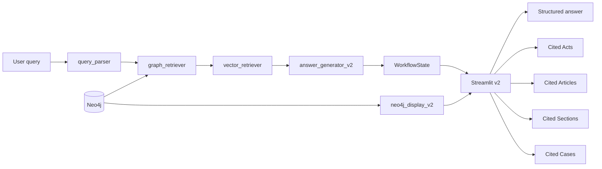

# Phase 4 v2: Structured answers and cited references (Acts, Articles, Sections, Cases)

## Goal

- **Structured answers**: LLM responds in a fixed format (Summary, Applicable laws, Relevant case law, Recommendation) so both factual queries and incident-style queries get consistent, scannable answers.
- **Cited references in UI**: Streamlit v2 shows four panels—**Acts**, **Articles**, **Sections**, **Cases**—using data from Neo4j (and retrieval state) so users see exactly which acts/sections/articles/cases the answer is based on.
- **No in-place edits**: All changes live in new `_v2` files; existing `streamlit_app.py`, `langgraph_workflow.py`, and `neo4j_client.py` stay unchanged.

## Data flow (v2)

## New files

| File                                                                       | Purpose                                                                                                                                                                                                                                                                                                                                                                                                                                                                                                                                        |
| -------------------------------------------------------------------------- | ---------------------------------------------------------------------------------------------------------------------------------------------------------------------------------------------------------------------------------------------------------------------------------------------------------------------------------------------------------------------------------------------------------------------------------------------------------------------------------------------------------------------------------------------- |
| [phase4_rag/neo4j_display_v2.py](phase4_rag/neo4j_display_v2.py)           | Neo4j helpers for **display only**: fetch act names by act_id, and case details (case_id, year, short judgment snippet) by case_id. Uses project config for connection; does not modify [phase4_rag/neo4j_client.py](phase4_rag/neo4j_client.py).                                                                                                                                                                                                                                                                                              |
| [phase4_rag/langgraph_workflow_v2.py](phase4_rag/langgraph_workflow_v2.py) | Copy of [phase4_rag/langgraph_workflow.py](phase4_rag/langgraph_workflow.py) with one change: **answer_generator** uses a **structured-output prompt** that instructs the LLM to reply with markdown sections: `## Summary`, `## Applicable laws / provisions`, `## Relevant case law (if any)`, `## Recommendation / next steps`. Same state schema and graph; only prompt text and helper names (e.g. `_build_system_prompt_v2`) differ. Expose `build_app` (or `build_app_v2`) so the app can invoke the same pipeline with the new prompt. |
| [streamlit_app_v2.py](streamlit_app_v2.py)                                 | New Streamlit entrypoint. Same sidebar (status, top_k, etc.) and query area as [streamlit_app.py](streamlit_app.py), but: (1) calls the v2 workflow; (2) renders the **answer** as markdown (so ## headings show as structure); (3) adds a **Cited references** section with four subsections: **Acts**, **Articles**, **Sections**, **Cases**.                                                                                                                                                                                                |

## 1. neo4j_display_v2.py (new)

- **Purpose**: Fetch display-only data from Neo4j for the v2 UI. No changes to the existing neo4j client.
- **Connection**: Use `phase4_rag.config.settings` and the same connection pattern as the existing client (e.g. create driver from `NEO4J_URI/USER/PASSWORD`). Catch connection errors and return empty lists so the UI can still show retrieval-based citations when Neo4j is down.
- **Functions**:
  - `get_acts_by_ids(act_ids: List[str]) -> List[Dict]`  
  Cypher: `MATCH (a:Act) WHERE a.act_id IN $ids RETURN a.act_id AS act_id, a.act_name AS act_name, a.act_type AS act_type`.  
  Returns list of `{act_id, act_name, act_type}` for citation panel.
  - `get_case_details(case_ids: List[str], snippet_len: int = 300) -> List[Dict]`  
  Cypher: `MATCH (c:Case) WHERE c.case_id IN $ids RETURN c.case_id AS case_id, c.year AS year, c.judgment_text AS judgment_text`.  
  Truncate `judgment_text` to `snippet_len` in Python. Returns list of `{case_id, year, snippet}` for citation panel.
- **Error handling**: Wrap driver/session in try/except; on failure (e.g. Neo4jUnavailableError or generic Exception), return `[]` and optionally log, so Streamlit v2 can still show Articles/Sections/Cases from `graph_metadata` and `grouped_sources` even when Neo4j display queries fail.

## 2. langgraph_workflow_v2.py (new)

- **Content**: Copy of [phase4_rag/langgraph_workflow.py](phase4_rag/langgraph_workflow.py) in full, then adjust only the following.
- **Structured prompt (answer node)**:
  - **System prompt**: Keep the same “Indian law, answer only from context, cite section_id/article_id/case_id” idea, but add: “Structure your answer with these markdown headings: ## Summary, ## Applicable laws / provisions, ## Relevant case law (if any), ## Recommendation / next steps. Use brief bullets or short paragraphs under each. If a section does not apply (e.g. no case law), say so briefly.”
  - **User message**: Same as current (user question + context block); add one line: “Reply using ONLY the context above, in the structured format with the four headings.”
- **Do not leak internal labels**: Add to system prompt: "Do not include or repeat internal labels like [ARTICLE FROM KNOWLEDGE GRAPH] or [SECTION FROM KNOWLEDGE GRAPH] in your answer; cite sources only by article_id, section_id, or case_id (e.g. Constitution_Art_14, BNS_Sec_41)."
- **Strip internal context labels from answer**: The context block uses labels like `[ARTICLE FROM KNOWLEDGE GRAPH] Constitution_Art_14`. The LLM sometimes echoes these into its reply. Before setting `state["answer"]`, post-process the model output: remove the literal substrings `[ARTICLE FROM KNOWLEDGE GRAPH]` and `[SECTION FROM KNOWLEDGE GRAPH]`, then normalize whitespace (collapse multiple spaces, trim). Apply this in the answer_generator node in `langgraph_workflow_v2.py` right after getting the LLM response and before `state["answer"] = answer`.
- **State and graph**: Unchanged (same `WorkflowState`, same nodes and edges). No new state keys; `graph_metadata` and `grouped_sources` already carry what the UI needs for citations.
- **Entrypoint**: Export `build_app()` (same signature as current) so Streamlit v2 can call `build_app()` from this module.

## 3. streamlit_app_v2.py (new)

- **Layout**: Same as current app: sidebar (Neo4j, FAISS, Ollama, top_k), main area with query text area and “Run Graph-Constrained RAG” button. After a run, show:
  1. **Answer** – `st.markdown(state["answer"])` so the structured ## sections render.
  2. **Status line** – Same as current (graph/vector/fallback).
  3. **Cited references** – Four panels: Acts, Articles, Sections, Cases.
  4. **Retrieved text snippets** – Same expanders as current (optional; can keep or shorten).
- **Cited Acts**:
  - Collect unique `act_id` from `graph_metadata["sections"]` and `graph_metadata["articles"]` (each has `act_id`).
  - Call `neo4j_display_v2.get_acts_by_ids(act_ids)`.
  - Display a table or list: act_id, act_name, act_type. If Neo4j fails, show “Acts: unavailable” or an empty list.
- **Cited Articles**:
  - From `graph_metadata["articles"]`: article_id, article_number, act_id; optionally first 200 chars of full_text as snippet.
  - Merge with any articles from `grouped_sources["article"]` that might not be in graph_metadata (e.g. retrieval-only). Display table: article_id, article_number, act_id, snippet (optional).
- **Cited Sections**:
  - From `graph_metadata["sections"]`: section_id, section_number, act_id; optional short full_text snippet.
  - Merge with `grouped_sources["section"]` for retrieval-only sections. Display table: section_id, section_number, act_id, snippet (optional).
- **Cited Cases**:
  - From `graph_metadata["cases"]`: case_id, year.
  - Optionally call `neo4j_display_v2.get_case_details(case_ids)` to get a short judgment snippet for each.
  - Also include cases that appear only in `grouped_sources["case"]` (retrieval). Display: case_id, year, snippet (if available).
- **Run command**: User runs v2 with `streamlit run streamlit_app_v2.py`.

## 4. Summary

- **Structured answer**: Achieved by a v2-only prompt in `langgraph_workflow_v2.py` that asks for four markdown sections; Streamlit v2 renders the answer as markdown.
- **Cited references**: Sourced from existing state (`graph_metadata`, `grouped_sources`) plus two new Neo4j display helpers in `neo4j_display_v2.py` (acts by id, case details with snippet). Streamlit v2 assembles and shows Acts, Articles, Sections, and Cases in dedicated panels.
- **Existing system**: Unchanged; all new logic is in `*_v2` files.

