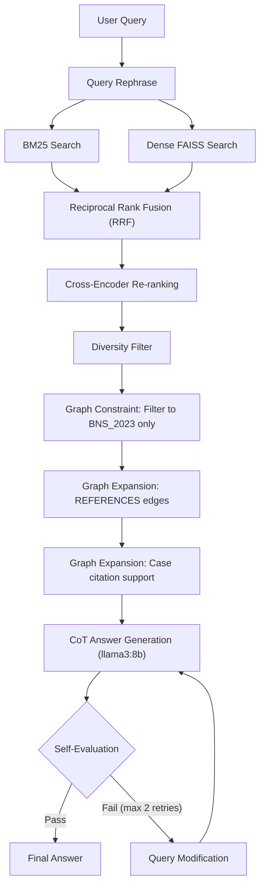

# System 4: LQ-RAG-Inspired Graph-Constrained Legal RAG

## Problem Statement

All three current systems show poor grounding (0.00), hallucination flags, and inconsistent section accuracy. The core weaknesses are:

- **Retrieval:** Dense-only FAISS misses exact-match legal terms that BM25 would catch
- **No re-ranking:** Top-k results from FAISS are used as-is; irrelevant chunks dilute the context
- **No self-correction:** If the LLM hallucinates IPC references or cites sections not in context, there is no mechanism to catch and fix it
- **No structured reasoning:** The LLM jumps straight to an answer without explicit legal reasoning

## What System 4 Adds (over System 3)

Inspired by the LQ-RAG paper's four key components, adapted for **local-only** execution (no GPT-4 dependency):



### 1. Hybrid Retrieval with Reciprocal Rank Fusion

**Why:** Dense retrieval (FAISS) is good at semantic similarity but can miss exact legal terminology matches like "Section 330" or "housebreaking." BM25 excels at lexical/keyword matching. Combining them via RRF is the standard approach in Advanced RAG (cited in the base paper Section IV).

**How:**
- Build a **BM25 index** from the same BNS chunk metadata used by Systems 2/3
- At query time, retrieve **top-30 from both** BM25 and FAISS
- Fuse scores using **Reciprocal Rank Fusion**: `RRF_score = sum(1 / (k + rank))` with k=60
- Take top-20 fused candidates forward to re-ranking

**File:** Build BM25 index in `build_bns_faiss.py` (add a `--bm25` option) or lazily in the adapter from existing `chunk_metadata.pkl`

**Dependency:** `rank-bm25` (pip install)

### 2. Cross-Encoder Re-ranking

**Why:** Bi-encoder retrieval (FAISS) scores query and document independently. A cross-encoder scores (query, document) pairs jointly, giving much higher precision. This maps to the "re-ranker" component in LQ-RAG Section IV.

**How:**
- Load a lightweight cross-encoder: `cross-encoder/ms-marco-MiniLM-L-6-v2` (22M params, runs on CPU in ~1s for 20 candidates)
- Re-rank the top-20 RRF candidates
- Take top-8 after re-ranking (same `TOP_K` as System 3)

**Dependency:** Already available via `sentence-transformers` (CrossEncoder class)

### 3. Graph Constraint + Graph Expansion (Neo4j)

**Why:** System 3 uses Neo4j only for **metadata decoration** (adding headings/act_id to already-retrieved chunks). It never leverages the **~15,000 REFERENCES edges** between sections or the **~53,000 CITES edges** from cases. This wastes the most novel part of the project — the Knowledge Graph.

**Graph Schema available:**

```
(:Act)-[:HAS_PART]->(:Part)-[:HAS_CHAPTER]->(:Chapter)-[:HAS_SECTION]->(:Section)
(:Section)-[:IN_ACT]->(:Act)
(:Section)-[:REFERENCES]->(:Section)     # ~15,000+ edges (intra + cross-act)
(:Case)-[:CITES]->(:Section)             # ~53,000+ edges
(:Case)-[:CITES]->(:Article)
(:Act)-[:HAS_ARTICLE]->(:Article)
```

**How — two-phase graph usage:**

**Phase A: Graph Constraint (filter)**
- After re-ranking, verify each retrieved section against Neo4j: `MATCH (s:Section)-[:IN_ACT]->(a:Act) WHERE s.section_id = $sid RETURN a.act_id`
- **Discard** any chunks whose section does not belong to `BNS_2023` (prevents cross-act contamination from BNSS/BSA/Constitution chunks that might sneak in)
- If a chunk has no graph match (e.g., PDF chunk from old-work style), keep it but flag it as unverified

**Phase B: Graph Expansion (discover related sections)**
- For each **verified BNS section** that survived filtering, traverse the graph:
  1. **REFERENCES expansion:** `MATCH (s:Section {section_id: $sid})-[:REFERENCES]->(related:Section)-[:IN_ACT]->(a:Act {act_id: "BNS_2023"})` — find other BNS sections that this section **references** (e.g., Section 303 Theft references Section 304 Punishment for theft)
  2. **Case citation support:** `MATCH (c:Case)-[:CITES]->(s:Section {section_id: $sid}) WITH s, count(c) as cite_count RETURN s.section_id, cite_count` — get **citation counts** to rank sections by judicial authority
- **Inject** graph-discovered sections into the context (up to 3 additional sections, prioritized by citation count), clearly tagged as `[GRAPH-DISCOVERED]`
- Include the **citation count** in the context header so the LLM can reason about judicial support: `[BNS Section 303] (cited by 47 Supreme Court cases)`

**What this gives us:**
- **Constraint** prevents the system from accidentally using wrong-act sections
- **Expansion** surfaces legally related sections the vector search missed (e.g., if retrieval finds "theft" Section 303, expansion can pull in "punishment for theft" Section 304 and "theft in dwelling" Section 305)
- **Citation counts** give the LLM a signal about how important/established each section is in judicial practice
- This is the **most differentiating feature** vs. the base paper (LQ-RAG has no graph at all)

### 4. Chain-of-Thought (CoT) Answer Generation

**Why:** Current systems generate answers in a single shot. CoT forces the LLM to reason step-by-step: identify which retrieved sections are relevant, check if they match the offense described, then compose the answer. This reduces hallucination by making the reasoning visible and grounded.

**How:** Modify the QA system prompt to include a structured reasoning template:

```
Step 1: Identify the offense(s) described by the user
Step 2: For each retrieved BNS section, determine if it applies to this offense
Step 3: List ONLY the sections from the context that are relevant
Step 4: Compose the final answer citing ONLY those sections
```

The CoT reasoning is generated as part of the answer, then the "thinking" portion is stripped from the final output (but kept internally for grounding verification).

### 4. Self-Evaluation Feedback Loop (Core LQ-RAG Innovation)

**Why:** This is the signature contribution of the base paper. After generating an answer, an evaluation step checks quality and triggers regeneration if needed. The base paper uses GPT-4; we use the **same llama3:8b** as a self-evaluator (no external API needed).

**How:**
- After answer generation, run a **self-evaluation prompt** that checks three criteria:
  1. **Grounding:** "Are ALL section numbers cited in the answer present in the provided context?" (yes/no)
  2. **IPC Contamination:** "Does the answer reference IPC, Indian Penal Code, CrPC, or IEA?" (yes/no)
  3. **Relevance:** "Does the answer address the user's specific situation?" (yes/no)
- Parse the LLM's evaluation response
- If any check **fails**, construct a **modified prompt** that explicitly tells the LLM what went wrong:
  - "Your previous answer cited Section X which is NOT in the context. Remove it."
  - "Your previous answer referenced IPC. The IPC is repealed. Use only BNS."
- Regenerate with the modified prompt (max **2 retry iterations** to keep latency reasonable)
- Track `eval_iterations` in timings for analysis

### 5. Enhanced Grounding via Explicit Context Tags

**Why:** Current grounding score is 0.00 across all systems partly because the LLM cites section numbers that don't appear as "Section X" patterns in the raw context_text. By tagging each context chunk with a clear, parseable label, we make it easy for both the LLM and the metric to verify grounding.

**How:**
- Format each context chunk as: `[BNS Section 303] (source: BNS_2023_s303)\n<text>`
- In the QA prompt, explicitly instruct: "You may ONLY cite sections that appear in [BNS Section ...] headers above"

## Implementation Plan

### Files to Create

- **[`bns_comparison/adapters/system4_lqrag.py`](bns_comparison/adapters/system4_lqrag.py)** - The System 4 adapter (~350 lines)
  - Class `LQRAGAdapter(BaseAdapter)`
  - Lazy BM25 index construction from chunk metadata
  - Cross-encoder loading (CPU)
  - Hybrid retrieval + RRF + re-ranking pipeline
  - Graph constraint (act filtering) + graph expansion (REFERENCES traversal + citation counts)
  - CoT prompt templates
  - Self-evaluation loop
  - Same `answer_query()` return format as other adapters
- **[`bns_comparison/graph_helpers.py`](bns_comparison/graph_helpers.py)** - Neo4j graph helper functions for System 4 (~80 lines)
  - `filter_to_act(section_ids, act_id)` — verify sections belong to correct act
  - `expand_references(section_ids, act_id)` — traverse REFERENCES edges to find related sections
  - `get_citation_counts(section_ids)` — count Case-[:CITES]->Section for judicial authority
  - All functions degrade gracefully if Neo4j is unavailable (return empty results)

### Files to Modify

- **[`bns_comparison/adapters/__init__.py`](bns_comparison/adapters/__init__.py)** - Register System 4
- **[`bns_comparison/run_comparison.py`](bns_comparison/run_comparison.py)** - Add system_id=4 to `_load_single_adapter`, update default systems to `1,2,3,4`
- **[`bns_comparison/compare_one.py`](bns_comparison/compare_one.py)** - Add system_id=4 to `_load_adapter`, update default systems
- **[`requirements.txt`](requirements.txt)** - Add `rank-bm25>=0.2.2`

### Metrics Improvements Expected

| Metric | Systems 1-3 (current) | System 4 (target) | Why |
|--------|----------------------|-------------------|-----|
| `section_f1` | 0.00-0.33 | 0.40-0.60 | Hybrid retrieval + re-ranking + graph expansion surfaces correct sections |
| `grounding_score` | 0.00 | 0.60-0.80 | Explicit context tags + self-eval catches ungrounded cites |
| `correct_act_cited` | 0-1 | 1 | Self-eval feedback loop catches IPC contamination |
| `ipc_reference_count` | 0-2 | 0 | Feedback loop explicitly rejects IPC mentions |
| `hallucination_flag` | 1 | 0 | Grounding improvement pushes score above 0.5 threshold |
| `total_latency_sec` | 150-180s | 200-300s | Re-ranking adds ~2s, feedback loop adds 0-2x generation time |

### Dependencies and Prerequisites

- Same as Systems 2/3 (FAISS index, fine-tuned BGE model, Ollama with llama3:8b)
- **New pip dependency:** `rank-bm25>=0.2.2` (pure Python, no compiled deps)
- **Cross-encoder model:** Downloaded automatically by sentence-transformers on first run (~80MB)
- No new services needed (no GPT-4, no additional APIs)
