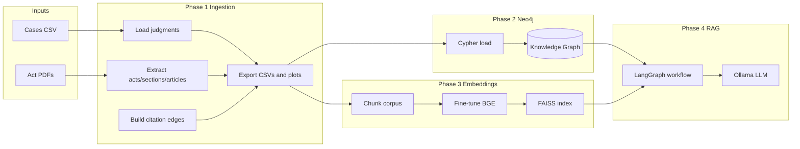

# LegalRAG: System Architecture

This document describes the **end-to-end architecture** of LegalRAG: how data flows from raw inputs through ingestion, graph load, embeddings, and the RAG application.

## High-level flow

1. **Phase 1 (Ingestion)** — Load judgments (CSV or PDFs) and act PDFs; extract sections/articles; build citation edges; write Neo4j-ready CSVs and plots to `phase1_output/`.
2. **Phase 2 (Neo4j)** — Copy Phase 1 CSVs into Neo4j’s `import/` directory; run Cypher scripts to create nodes (Act, Section, Article, Case) and relationships (IN_ACT, CITES). The result is the **knowledge graph**.
3. **Phase 3 (Embeddings)** — Chunk Phase 1 cases/sections/articles; fine-tune BGE on IndicLegalQA; build a FAISS index and chunk metadata. The result is **vector retrieval** (used by Phase 4).
4. **Phase 4 (RAG)** — LangGraph workflow: parse query → Neo4j (sections/articles/cases) → rephrase query → FAISS retrieval (optionally constrained) → Ollama answer. Served via Streamlit or invoked programmatically.

Phase 2 and Phase 3 are independent consumers of Phase 1 output. Phase 4 uses both the graph (Neo4j) and the vector index (FAISS + Phase 3 model).

## Diagram (overview)

## Technologies

| Layer | Technology |
|-------|------------|
| Ingestion | Python, pandas, pdfplumber, regex |
| Graph | Neo4j 5.x, Cypher |
| Embeddings | Sentence Transformers (BGE), FAISS, PyTorch/transformers |
| RAG orchestration | LangGraph (StateGraph) |
| LLM | Ollama (local, e.g. llama3:8b) |
| UI | Streamlit |

## Data artifacts (summary)

| Artifact | Produced by | Consumed by |
|----------|-------------|-------------|
| phase1_output/*.csv | Phase 1 | Phase 2 (after copy), Phase 3 |
| phase1_output/*.png | Phase 1 | Optional (reporting) |
| Neo4j graph | Phase 2 | Phase 4 |
| chunks.pkl | Phase 3 | Phase 3 (build_faiss) |
| phase3_embeddings/models/bge-legal | Phase 3 | Phase 3 (build_faiss, retrieve), Phase 4 |
| faiss.index, chunk_metadata.pkl | Phase 3 | Phase 4 |

## Exporting for PPT

Copy the Mermaid block above into [Mermaid Live Editor](https://mermaid.live) and export as PNG or SVG for slides.
