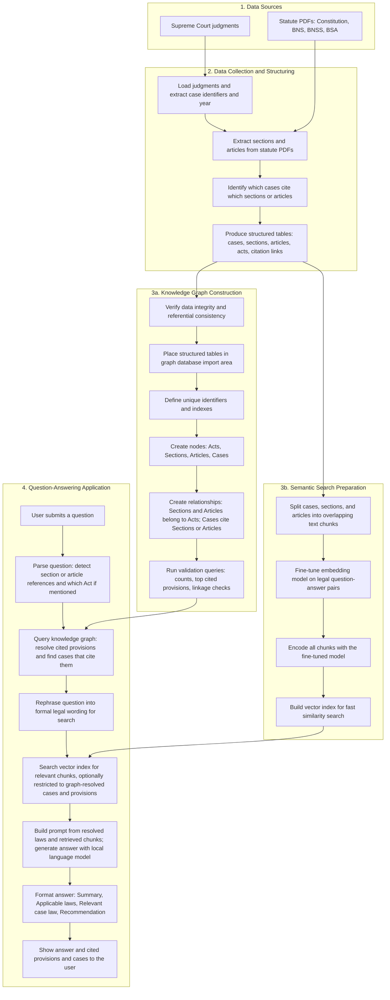

# LegalRAG: Implementation Plan (Big Picture)

This document presents the **end-to-end implementation plan** of LegalRAG as a single, report-oriented overview. It shows how raw legal data is collected and structured, how a knowledge graph and a semantic search layer are built in parallel, and how the final application answers user questions using both.

---

## Overall Process: From Data to Answer

The system is implemented in **four phases**. The first phase produces a single set of structured datasets. The second and third phases use that output independently to build a **knowledge graph** (who cited which law) and a **semantic search index** (meaning-based retrieval). The fourth phase combines both into one **question-answering application** that resolves laws, retrieves relevant text, and generates structured answers.

The diagram below captures this flow in report terms: what is collected, what is produced, and how the user-facing application works.

---

## End-to-End Implementation Diagram

---

## Summary for Report

| Stage | Purpose |
|-------|---------|
| **1. Data sources** | Supreme Court judgments (CSV or PDF) and statute PDFs (Constitution, BNS, BNSS, BSA) form the raw input. |
| **2. Data collection and structuring** | Judgments are loaded and normalized; sections and articles are extracted from statutes; citation links (case → section/article) are detected and exported as structured tables. This is the single upstream output used by both the graph and the search pipeline. |
| **3a. Knowledge graph construction** | The structured tables are verified, loaded into a graph database, and linked so that Acts contain Sections and Articles, and Cases point to the provisions they cite. Validation queries confirm counts and linkage. |
| **3b. Semantic search preparation** | The same case, section, and article text is chunked; an embedding model is fine-tuned on legal Q&A data; all chunks are encoded and stored in a vector index for fast similarity search. |
| **4. Question-answering application** | The user asks a question. The system parses it for law references, resolves those in the knowledge graph, rephrases the question for search, retrieves relevant chunks (optionally constrained by the graph), and generates a structured answer (summary, applicable laws, case law, recommendation) using a local language model. The answer and cited provisions and cases are shown to the user. |

Together, the knowledge graph ensures that **which law and which cases** are used is explicit and traceable; the semantic index ensures that **relevant wording** is retrieved; and the application ties both into one coherent answer for reporting and presentation.
