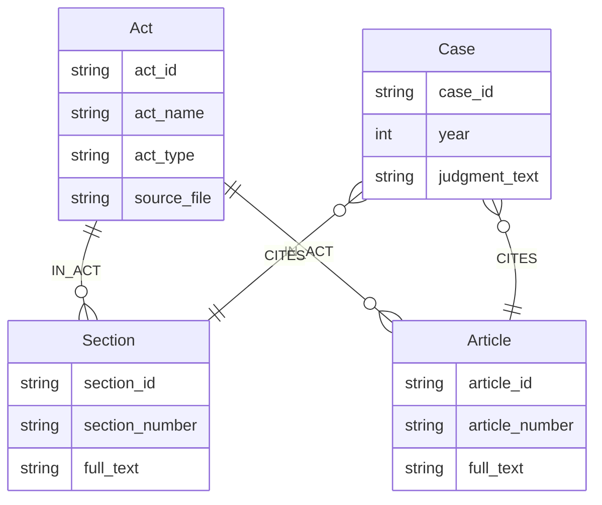

# Knowledge Graph (Neo4j) Schema and Usage

This document describes the **Neo4j knowledge graph** used by LegalRAG: node labels, properties, relationships, how the graph is built (Phase 2), and how it is queried in the RAG workflow (Phase 4).

## Node labels and properties

| Label | Properties | Unique key | Description |
|-------|------------|------------|-------------|
| **Act** | act_id, act_name, act_type, source_file | act_id | A statute or the Constitution (e.g. BNS, Constitution). |
| **Section** | section_id, section_number, full_text | section_id | A section of an act (e.g. BNS_Sec_302). Linked to Act via IN_ACT. |
| **Article** | article_id, article_number, full_text | article_id | An article (e.g. Constitution_Art_14). Linked to Act via IN_ACT. |
| **Case** | case_id, year, judgment_text | case_id | A Supreme Court case (judgment). |

Constraints (from `neo4j/cypher/01_constraints.cypher`): unique on `case_id`, `act_id`, `section_id`, `article_id`. Optional indexes on `Case.year`, `Section.section_number`, `Article.article_number`.

## Relationships

| Type | From | To | Properties | Meaning |
|------|------|-----|------------|---------|
| **IN_ACT** | Section | Act | — | This section belongs to this act. |
| **IN_ACT** | Article | Act | — | This article belongs to this act. |
| **CITES** | Case | Section or Article | count (optional) | The case cites this section/article; count aggregates duplicate citations. |

The graph is thus: **Acts** as roots; **Sections** and **Articles** linked to Acts by IN_ACT; **Cases** linked to Sections/Articles by CITES. No direct Case–Act relationship; act membership is inferred via Section/Article.

## How the graph is built (Phase 2)

1. **01_constraints.cypher** — Create uniqueness constraints and indexes (run once per database).
2. **02_load_nodes.cypher** — LOAD CSV from `acts.csv`, `sections.csv`, `articles.csv`, `cases.csv` (files must be in Neo4j’s `import/` directory). Creates Act, Section, Article, Case nodes and `(Section)-[:IN_ACT]->(Act)`, `(Article)-[:IN_ACT]->(Act)`.
3. **03_load_edges.cypher** — LOAD CSV from `edges.csv`. Matches Case by source_case_id and Section/Article by target_section_or_article; creates `(Case)-[:CITES]->(Section|Article)` with optional `count` on the relationship.

All CSV data comes from Phase 1 output; see [Phase2_Neo4j.md](Phase2_Neo4j.md) and [Datasets.md](Datasets.md).

## How the graph is queried (Phase 4)

The RAG workflow uses `phase4_rag/neo4j_client_v3.py` (and the base `neo4j_client.py` for `get_cases_citing_ids`):

| Function | Purpose | Cypher pattern |
|----------|---------|----------------|
| **get_sections_by_numbers(section_numbers, act_id=None)** | Resolve sections by section_number; optionally filter by act (e.g. BNS). | MATCH (s:Section)-[:IN_ACT]->(a:Act) WHERE s.section_number IN $nums AND ($act_id IS NULL OR a.act_id = $act_id) RETURN s.section_id, s.section_number, a.act_id, a.act_name, s.full_text |
| **get_articles_by_numbers(article_numbers, act_id=None)** | Resolve articles by article_number; optionally filter by act. | MATCH (ar:Article)-[:IN_ACT]->(a:Act) WHERE ar.article_number IN $nums AND ($act_id IS NULL OR a.act_id = $act_id) RETURN ar.article_id, ar.article_number, a.act_id, a.act_name, ar.full_text |
| **get_cases_citing_ids(ids)** | Find cases that cite any of the given section/article IDs. | MATCH (c:Case)-[r:CITES]->(t) WHERE coalesce(t.section_id, t.article_id) IN $ids RETURN c.case_id, c.year (and optionally judgment snippet) |

Act-aware filtering (act_id) avoids ambiguity when the same section number exists in multiple acts (e.g. BNS vs BNSS). The query parser (query_parser_v3) can set section_act_id/article_act_id from phrases like “Section 302 of BNS”.

## Diagram (entity-relationship style)

## Exporting for PPT

Copy the Mermaid block above into [Mermaid Live](https://mermaid.live) and export as PNG or SVG for slides.
