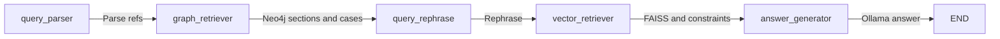

# LangGraph RAG Workflow Architecture

This document describes the **Phase 4 RAG workflow** implemented as a LangGraph state graph in `phase4_rag/langgraph_workflow_v3.py`: state schema, entry point, nodes, edges, and how to export the diagram for PPTs.

## State: WorkflowState

The graph uses a single shared state (TypedDict, all keys optional):

| Key | Type | Set by | Meaning |
|-----|------|--------|---------|
| user_query | str | Input | Raw user question. |
| legal_query | str | query_rephrase | Formal legal query used for retrieval. |
| parsed_query | dict | query_parser | article_numbers, section_numbers, explicit_ids, section_act_id, article_act_id, has_explicit_refs. |
| graph_constraints | dict | graph_retriever | allowed_case_ids, allowed_section_ids, allowed_article_ids for vector filter. |
| graph_metadata | dict | graph_retriever | sections, articles, cases from Neo4j (for prompt). |
| applicable_acts | list | graph_retriever | List of {act_id, act_name} for display. |
| retrieved_chunks | list | vector_retriever | Chunks from FAISS (with scores). |
| grouped_sources | dict | vector_retriever | Chunks grouped by source_type and source_id. |
| used_fallback_unconstrained | bool | vector_retriever | True if constrained retrieval was skipped. |
| top_faiss_similarity | float | vector_retriever | Best similarity score (optional). |
| graph_error | str | graph_retriever | Set if Neo4j fails. |
| vector_error | str | vector_retriever | Set if FAISS/load fails. |
| answer | str | answer_generator | Final model reply. |
| answer_no_applicable_laws | bool | answer_generator | True if answer says no applicable laws. |
| answer_no_relevant_cases | bool | answer_generator | True if answer says no relevant cases. |

## Entry point and edges

- **Entry point:** `query_parser`.
- **Edges (linear):**  
  `query_parser` → `graph_retriever` → `query_rephrase` → `vector_retriever` → `answer_generator` → END.

No conditional branching; the graph runs once through the five nodes.

## Nodes (what each does)

| Node | Inputs used | Action | Outputs written |
|------|-------------|--------|------------------|
| **query_parser** | user_query | Parse query for article/section numbers and optional act context (e.g. "Section 302 of BNS"). | parsed_query |
| **graph_retriever** | parsed_query | Neo4j: get sections/articles by number (optionally by act_id), get cases citing those IDs. Build constraints and metadata. | graph_constraints, graph_metadata, applicable_acts; or graph_error |
| **query_rephrase** | user_query | Call Ollama to rewrite user question as formal legal query. | legal_query |
| **vector_retriever** | legal_query (or user_query), graph_constraints | Embed query; FAISS search; optionally filter/diversify by graph_constraints. | retrieved_chunks, grouped_sources, vector_error, used_fallback_unconstrained, top_faiss_similarity |
| **answer_generator** | graph_metadata, grouped_sources, user_query | Build prompt (graph + retrieval context); call Ollama; strip labels, fix markdown; detect no-laws/no-cases. | answer, answer_no_applicable_laws, answer_no_relevant_cases |

Key functions: `parse_query` (query_parser_v3), `get_sections_by_numbers` / `get_articles_by_numbers` / `get_cases_citing_ids` (neo4j_client_v3), `retrieve_chunks` / `group_by_source` (vector_retriever_v3), `chat_completion` (llm_ollama). Config: `phase4_rag/config_v3.settings`.

## Diagram (workflow)

## Exporting for PPT

Copy the Mermaid block above into [Mermaid Live](https://mermaid.live) and export as PNG or SVG for slides.
</think>
