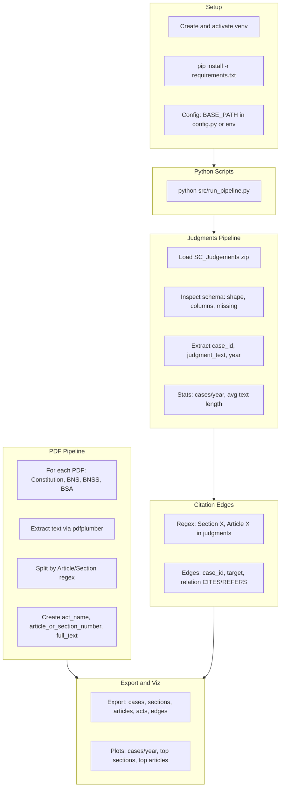

# Phase 1: Architecture Diagram

```mermaid
flowchart TB
    subgraph Setup [Setup]
        Venv[Create and activate venv]
        PipInstall[pip install -r requirements.txt]
        Config[Config: BASE_PATH in config.py or env]
    end
    
    subgraph Scripts [Python Scripts]
        RunMain[python src/run_pipeline.py]
    end
    
    subgraph Judgments [Judgments Pipeline]
        LoadZip[Load SC_Judgements zip]
        Inspect[Inspect schema: shape, columns, missing]
        ExtractCols[Extract case_id, judgment_text, year]
        Stats1[Stats: cases/year, avg text length]
    end
    
    subgraph PDFs [PDF Pipeline]
        PDFLoop[For each PDF: Constitution, BNS, BNSS, BSA]
        ExtractText[Extract text via pdfplumber]
        SplitRegex[Split by Article/Section regex]
        StructTable[Create act_name, article_or_section_number, full_text]
    end
    
    subgraph Edges [Citation Edges]
        RegexCite[Regex: Section X, Article X in judgments]
        BuildEdges[Edges: case_id, target, relation CITES/REFERS]
    end
    
    subgraph Export [Export and Viz]
        ExportCSV[Export: cases, sections, articles, acts, edges]
        Plots[Plots: cases/year, top sections, top articles]
    end
    
    Setup --> Scripts
    Scripts --> Judgments
    Judgments --> Edges
    PDFs --> Export
    Edges --> Export
```
