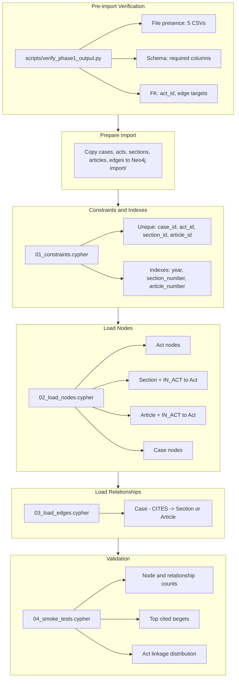

# Phase 2: Neo4j KG Build Diagram

```mermaid
flowchart TB
    subgraph Verify [Pre-import Verification]
        VerifyScript[scripts/verify_phase1_output.py]
        FileCheck[File presence: 5 CSVs]
        SchemaCheck[Schema: required columns]
        FKCheck[FK: act_id, edge targets]
        VerifyScript --> FileCheck
        VerifyScript --> SchemaCheck
        VerifyScript --> FKCheck
    end

    subgraph Copy [Prepare Import]
        CopyCSVs[Copy cases, acts, sections, articles, edges to Neo4j import/]
    end

    subgraph Schema [Constraints and Indexes]
        Constraints[01_constraints.cypher]
        UniqueIds[Unique: case_id, act_id, section_id, article_id]
        Indexes[Indexes: year, section_number, article_number]
        Constraints --> UniqueIds
        Constraints --> Indexes
    end

    subgraph LoadNodes [Load Nodes]
        LoadCypher[02_load_nodes.cypher]
        Acts[Act nodes]
        Sections[Section + IN_ACT to Act]
        Articles[Article + IN_ACT to Act]
        Cases[Case nodes]
        LoadCypher --> Acts
        LoadCypher --> Sections
        LoadCypher --> Articles
        LoadCypher --> Cases
    end

    subgraph LoadEdges [Load Relationships]
        EdgesCypher[03_load_edges.cypher]
        CITES[Case - CITES -> Section or Article]
        EdgesCypher --> CITES
    end

    subgraph SmokeTests [Validation]
        SmokeCypher[04_smoke_tests.cypher]
        Counts[Node and relationship counts]
        TopCited[Top cited targets]
        ActLink[Act linkage distribution]
        SmokeCypher --> Counts
        SmokeCypher --> TopCited
        SmokeCypher --> ActLink
    end

    Verify --> Copy
    Copy --> Schema
    Schema --> LoadNodes
    LoadNodes --> LoadEdges
    LoadEdges --> SmokeTests
```
