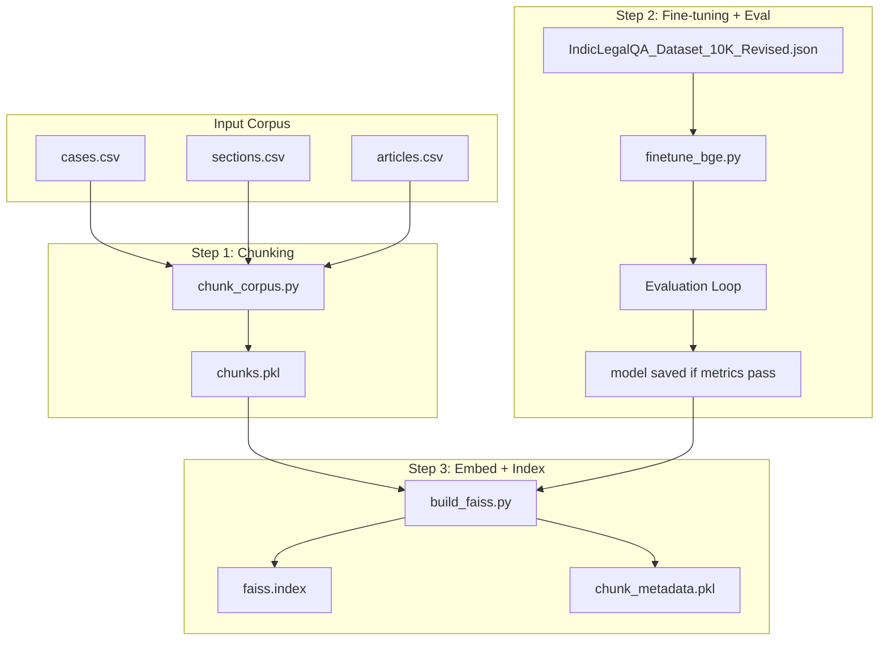

# Phase 3: Embeddings Pipeline Diagram

```mermaid
flowchart TB
    subgraph Inputs [Input Corpus]
        cases[cases.csv]
        sections[sections.csv]
        articles[articles.csv]
    end

    subgraph Chunking [Step 1: Chunking]
        ChunkScript[chunk_corpus.py]
        ChunkScript --> chunks_pkl[chunks.pkl]
    end

    subgraph Finetune [Step 2: Fine-tuning + Eval]
        FinetuneScript[finetune_bge.py]
        IndicQA[IndicLegalQA_Dataset_10K_Revised.json]
        IndicQA --> FinetuneScript
        FinetuneScript --> Eval[Evaluation Loop]
        Eval --> LocalModel[model saved if metrics pass]
    end

    subgraph Build [Step 3: Embed + Index]
        BuildScript[build_faiss.py]
        chunks_pkl --> BuildScript
        LocalModel --> BuildScript
        BuildScript --> faiss_idx[faiss.index]
        BuildScript --> meta_pkl[chunk_metadata.pkl]
    end

    cases --> ChunkScript
    sections --> ChunkScript
    articles --> ChunkScript
```
