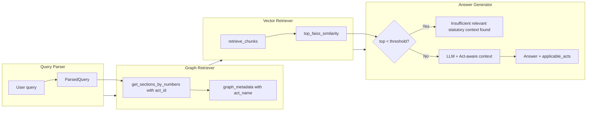
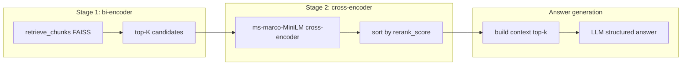

# Phase 4: RAG (V3) Data Flow Diagram

## Optional: two-stage retrieval with cross-encoder (System S4)

The default V3 flow above passes **FAISS-ranked chunks** straight to the answer generator. The **rerank experiment** (`rerank_experiment/adapter.py`) inserts a **cross-encoder** between dense retrieval and prompt construction:

Use this block in the thesis as the **reranker architecture** figure (see `MTech Thesis/content/figures.md` Figure 6).
