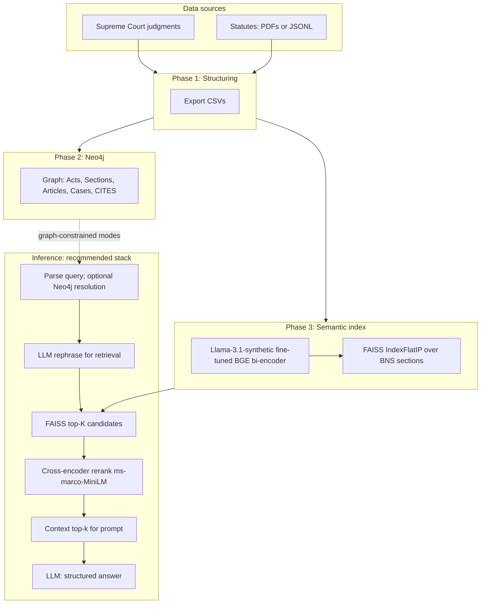

# Chapter: System Implementation

This chapter presents the **implemented LegalRAG stack** at the level of detail expected in an M.Tech thesis: data and knowledge-graph preparation, dense retrieval with **domain-adapted embeddings**, optional **two-stage retrieval** with a cross-encoder reranker, answer generation, and **evaluation**. The **reference architecture** we position as the strongest integrated design is the pipeline that combines (i) structured corpora and Neo4j, (ii) a **BGE** bi-encoder **fine-tuned on Llama-3.1-generated incident–BNS pairs**, (iii) **FAISS** section retrieval, (iv) **cross-encoder reranking** (`cross-encoder/ms-marco-MiniLM-L-6-v2`), and (v) a **local LLM** (Ollama) for rephrasing and structured answers—realized in code primarily via `bns_comparison/`, `phase3_embeddings/`, `rerank_experiment/`, and shared adapters. The production **LangGraph v3** application (`phase4_rag/`) implements the same logical flow **without** wiring the reranker node; the **rerank-augmented** path is the **System S4** adapter used for controlled benchmarking (`rerank_experiment/adapter.py`).

Foundational ideas follow retrieval-augmented generation (Lewis et al., 2020), sentence embeddings (Reimers & Gurevych, 2019; Xiao et al., 2023), efficient similarity search (Johnson et al., 2019), passage reranking (Nogueira & Cho, 2019), and property-graph storage (Robinson et al., 2015). Full bibliographic entries are collected in `content/experiments.md` (Bibliography section).

---

## 3.1 Introduction and scope

Indian legal assistance requires **faithful** linkage between user scenarios and **statutory text** (e.g. Bharatiya Nyaya Sanhita, BNS). The system addresses this by:

1. **Structuring** judgments and statutes into CSVs with stable section and article identifiers.
2. **Loading** a **Neo4j** knowledge graph for act-aware resolution and case–provision citations.
3. **Indexing** statute (and corpus) chunks in **FAISS** using a **fine-tuned** dense encoder.
4. **Optionally reranking** top-\(K\) hits with a **cross-encoder** before prompting an LLM.
5. **Evaluating** retrieval and grounding on a fixed **100-case** BNS benchmark with explicit metrics.

The chapter proceeds as follows: §3.2 overall architecture; §3.3–3.6 phases; §3.7 reference retrieval and generation path; §3.8 evaluation metrics; §3.9 summarized results; §3.10 conclusion and future work.

---

## 3.2 Overall architecture

### 3.2.1 Dataflow

**Phase 1** ingests Supreme Court judgments (CSV or extracted PDFs) and statute PDFs (or optional JSONL page streams), extracts sections and articles, mines **citation edges** from judgment text to provisions, and exports **Neo4j-ready CSVs** (`cases`, `acts`, `sections`, `articles`, `edges`). **Phase 2** loads these into Neo4j with constraints and relationships `IN_ACT` and `CITES`. **Phase 3** chunks corpus text, **fine-tunes** `BAAI/bge-small-en-v1.5` on legal supervision (IndicLegalQA and/or BNS synthetic pairs), encodes chunks, and builds a **FAISS IndexFlatIP** index (cosine similarity on L2-normalized vectors). **Phase 4** (and the BNS benchmark adapters) parse the user query, query Neo4j when graph-aware behaviour is required, **rephrase** the query for retrieval, retrieve from FAISS, **optionally rerank**, and **generate** a structured answer.

### 3.2.2 Reference architecture diagram (Mermaid)

Export this figure for the thesis (e.g. [mermaid.live](https://mermaid.live)):

The **dashed** edge indicates that graph resolution is used where the application parses explicit sections or needs citing cases; the **solid** path is the **retrieval–rerank–generate** spine. **Streamlit LangGraph v3** currently skips **CE**; **System S4** (`rerank_experiment`) inserts **CE** between **K** and **CTX**.

### 3.2.3 Phase-level figures

Detailed diagrams: `Documentation/Phase1_Diagram.md` through `Documentation/Phase4_Diagram.md`, plus the rerank block in `Documentation/Phase4_Diagram.md`. A figure list is in `content/figures.md`.

---

## 3.3 Phase 1: Data ingestion and structuring

The main entry point is `src/run_pipeline.py` with `config.py`. Judgments yield `case_id`, `judgment_text`, `year`. Statute PDFs are parsed with `pdfplumber` and regex (`src/pdf_extractor.py`). **Citations** from judgments to sections/articles are detected with `src/edges.py` and written to `edges.csv`. Outputs are documented in `Documentation/Phase1_Ingestion.md`.

A **parallel** path, `phase1_preprocessing/act_parser.py` and `structure_export.py`, rebuilds **Part–Chapter–Section** hierarchy from **JSONL** page records when PDF lineation is poor.

---

## 3.4 Phase 2: Knowledge graph

CSVs are copied to Neo4j `import/`; scripts `neo4j/cypher/01_constraints.cypher` through `04_smoke_tests.cypher` create constraints, load nodes, load `CITES` edges, and validate counts. This layer supports act disambiguation and “cases citing section \(s\)” queries used in graph-aware RAG.

---

## 3.5 Phase 3: Chunking, fine-tuning, and FAISS

**Chunking** (`phase3_embeddings/chunk_corpus.py`) uses the BGE tokenizer with configurable size (e.g. 500 tokens) and overlap (e.g. 100). **Fine-tuning** (`phase3_embeddings/finetune_bge.py`) minimizes **MultipleNegativesRankingLoss** on `(query, positive passage)` batches (and **TripletLoss** for complaint hard-negative triplets):

\[
\mathcal{L}_{\text{MNRL}} = -\frac{1}{B}\sum_{i=1}^{B} \log \frac{\exp(s_{ii}/\tau)}{\sum_{j=1}^{B} \exp(s_{ij}/\tau)}
\]

where \(s_{ij}\) is cosine similarity between query \(i\) and passage \(j\) in the batch. **Development** quality is tracked with **InformationRetrievalEvaluator** on a 20% held-out split: **MRR@10**, **NDCG@10**, **Recall@10** (Järvelin & Kekäläinen, 2002; Manning et al., 2008). **Best validated BNS benchmark configuration** uses bi-encoder weights from **Llama 3.1** incident–BNS synthetic pairs produced by the project’s synthetic data generator, per experimentation chapter.

**FAISS** (`build_faiss.py`): L2-normalized embeddings, **IndexFlatIP**. **BNS-only** benchmarks use `bns_comparison/build_bns_faiss.py` over `sections.csv`.

---

## 3.6 Phase 4 and BNS adapters

**LangGraph v3** (`phase4_rag/langgraph_workflow_v3.py`) implements: parse → Neo4j retrieve → rephrase → vector retrieve → generate. **Benchmark** adapters in `bns_comparison/` and `rerank_experiment/` share the same **metric** definitions for fair comparison.

---

## 3.7 Two-stage retrieval: cross-encoder reranker

The **cross-encoder** (`cross-encoder/ms-marco-MiniLM-L-6-v2`) scores each pair \((q, \text{passage})\) for candidates returned by FAISS, reorders them, and passes the top-\(k\) into the prompt. This follows the standard **retrieve-then-rerank** pattern: bi-encoder for **scalability**, cross-encoder for **precision** on short lists (Nogueira & Cho, 2019). **System S4** (`System3RerankAdapter`) adds **citation-oriented filtering** (README in `rerank_experiment/`). Timings record `rerank_sec` separately from `retrieval_sec`.

---

## 3.8 Evaluation methodology

### 3.8.1 Automatic metrics (100-case BNS suite)

Metrics are implemented in `bns_comparison/metrics.py`. Let \(G\) be the **gold** BNS section set for a case, \(C\) the **cited** sections in the model answer, and \((s_1,\ldots,s_T)\) the sequence of section numbers implied by **retrieved chunks** in rank order.

| Metric | Formula (per case) | Aggregated report |
|--------|----------------------|-------------------|
| **Hit rate** | \(h = \mathbf{1}[G \cap \{s_1,\ldots,s_T\} \neq \emptyset]\) | Mean over \(n=100\) |
| **MRR** | First rank \(r\) with \(s_r \in G\): \(1/r\); else \(0\) | Mean |
| **Section precision** | \(\lvert C \cap G \rvert / \lvert C \rvert\) if \(C \neq \emptyset\), else \(0\) | Mean |
| **Section recall** | \(\lvert C \cap G \rvert / \lvert G \rvert\) if \(C \neq \emptyset\), else \(0\) | Mean |
| **Section F1** | \(2PR/(P+R)\) if \(P+R>0\), else \(0\) | Mean |
| **Grounding score** | With \(S_{\text{ctx}}\) sections extracted from **context**: \(\lvert C \cap S_{\text{ctx}} \rvert / \lvert C \rvert\) if \(C \neq \emptyset\), else \(1\) | Mean |

**Interpretation.** Hit rate and MRR stress **retrieval** against gold sections. Precision/recall/F1 stress **cited** sections vs gold. Grounding score checks whether citations are **literally present** in retrieved context—a **necessary** check for extractive faithfulness; it does not prove legal correctness.

### 3.8.2 Manual evaluation

A rubric-based **manual** pass (`evaluation/EVAL_AGENT_INSTRUCTIONS.md`) assigns **answer relevance**, **context relevance**, and **groundedness** in \([0,1]\) for all 100 cases (`gpt4_eval_results_manual_100.csv`), complementing automatic scores (Zheng et al., 2023).

### 3.8.3 Reproducibility

| Component | Command / path |
|-----------|----------------|
| BNS 100-case (dense, FT) | `evaluation/run_system3_100.py` |
| BNS 100-case (non-FT) | `evaluation/run_system3_100_nonft.py` |
| Rerank 100-case | `python -m rerank_experiment.run_100` |
| Results | `evaluation/results/system3_results_100_*.csv` |

---

## 3.9 Key results (summary)

Table 3.1 summarizes **row-wise means** over **\(n=100\)** cases for the primary systems (CSVs in `evaluation/results/`). **S3** figures were computed from `system3_results_100_nonft_bge_dedup.csv` (base BGE, no embedding fine-tuning on BNS supervision). **S4** full CSV was not present in the repository at documentation time; completing `python -m rerank_experiment.run_100` produces `system3_results_100_rerank_exp.csv` for the final rerank row.

**Table 3.1.** BNS benchmark means (higher is better except where noted).

| Metric | S1 Legacy | S2 **Llama-3.1-synthetic FT** | S3 Non-FT BGE | \(\Delta\) S2−S1 |
|--------|-----------|---------------------------|---------------|-----------------|
| Hit rate | 0.460 | **0.590** | 0.330 | +0.130 |
| MRR | 0.193 | **0.345** | 0.125 | +0.152 |
| Section precision | 0.130 | **0.159** | 0.094 | +0.029 |
| Section recall | 0.250 | **0.322** | 0.154 | +0.072 |
| Section F1 | 0.160 | **0.203** | 0.108 | +0.043 |
| Grounding score | 0.746 | **0.796** | 0.756 | +0.051 |

The **Llama-3.1-synthetic fine-tuned** encoder (**S2**) delivers the largest gains on **retrieval-centric** metrics relative to **S1** and strongly outperforms **S3**, isolating the value of **BNS-aligned** supervision. **Grounding** improves with **S2**, consistent with better retrieval overlap under a fixed generator.

---

## 3.10 Conclusion and future work

**Conclusion.** This work implements an end-to-end **graph-aware, retrieval-grounded** legal assistant pipeline: structured corpora and Neo4j provide **symbolic** anchors; **FAISS** and a **fine-tuned BGE** bi-encoder provide **semantic** recall; an optional **cross-encoder** refines candidate ordering; an LLM produces **structured** answers. The **strongest** validated embedding configuration for the BNS incident benchmark is **fine-tuning on Llama-3.1-generated synthetic incident–section pairs**; **non-fine-tuned** BGE (**S3**) lags sharply on hit rate and MRR. Automatic and manual evaluations show **measurable** gains, with remaining gaps in **section F1** and occasional **IPC vs BNS** wording in answers.

**Future work.**

1. **Complete S4 evaluation** — Finish the full 100-case rerank run and report significance / confidence intervals; ablate rerank model size and \(K \rightarrow k\) truncation policy.
2. **Integrate reranker into LangGraph v3** — Promote `rerank_experiment` logic into `vector_retriever_v3` behind a config flag for production parity with the thesis reference architecture.
3. **Data quality** — Curate complaint-derived supervision or filter noisy labels; revisit template and IPC-mapping pairs with **hard negative** mining.
4. **Citation calibration** — Post-process or constrain generation so answers **only** cite BNS sections present in context; extend metrics to penalize **IPC** references when BNS is required.
5. **Scale and latency** — Evaluate approximate nearest neighbours if the corpus grows; batch GPU reranking; cache embeddings for hot statutes.
6. **Human study** — Practitioner review beyond LLM-as-judge for deployment readiness.

This concludes the implementation chapter; the **experimentation chapter** details datasets, ablations, and comparative analysis behind Table 3.1.
