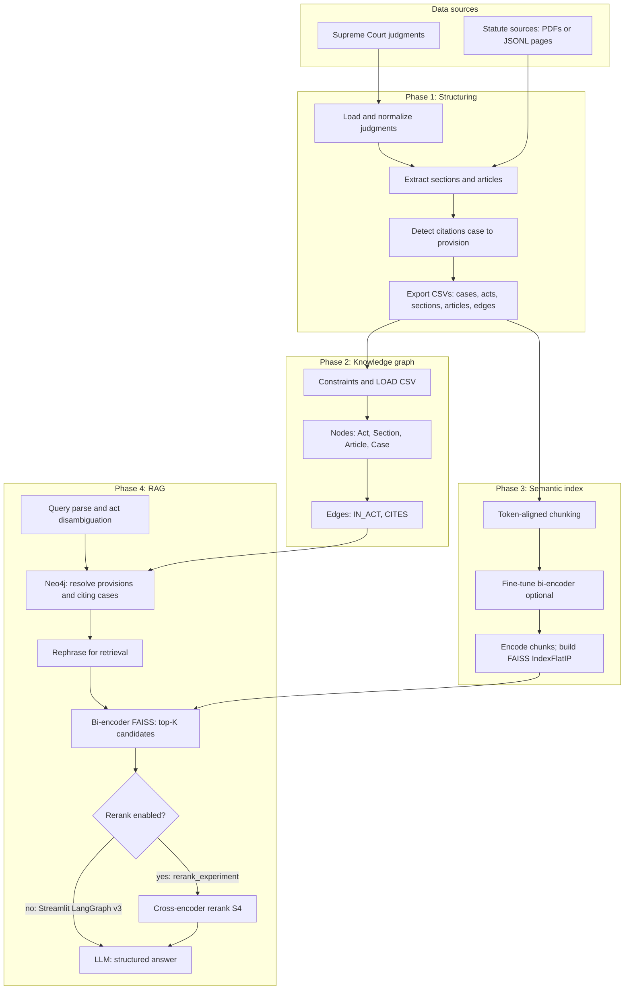

# System implementation

> **Thesis draft:** The polished chapter text for submission is in **`chapters/chapter_implementation.md`**. This file retains extended technical notes (Mermaid variants, metric derivations, repository paths).

This chapter describes the **design and realization** of LegalRAG from a thesis-oriented perspective: end-to-end architecture, per-phase algorithms and data flows, the embedding and retrieval stack (with mathematical objectives where they clarify the design), integration of the knowledge graph with dense retrieval, and how **evaluation metrics** are operationalized in code. Foundational retrieval-augmented generation and dense retrieval ideas are grounded in the literature cited inline and in the **Bibliography** at the end of **`experiments.md`** (the experiments chapter carries the full reference list to avoid duplication in the final thesis).

---

## 1. Problem setting and design rationale

The goal is to support **Indian legal question answering** over statutes (Constitution, Bharatiya Nyaya Sanhita and related acts) and Supreme Court judgments, with **traceable** references to provisions and, where applicable, citing cases. Following the RAG paradigm (Lewis et al., 2020), answers are conditioned on **retrieved** text rather than parametric knowledge alone, which reduces unfounded legal claims when retrieval is correct and grounding is enforced in prompts.

Three layers describe the retrieval stack (the third is **off by default** in production):

1. **Symbolic layer** — A **labeled property graph** (Neo4j) stores acts, sections, articles, cases, and **citation** relationships from judgments to provisions. This supports deterministic resolution of “Section *x* of BNS” and enumeration of cases that cite a provision (Robinson et al., 2015).
2. **Semantic layer (bi-encoder + FAISS)** — **Dense retrieval** over chunked text using a **sentence embedding** model (Reimers & Gurevych, 2019; Xiao et al., 2023), implemented with the **BGE** family (`BAAI/bge-small-en-v1.5`). Vectors are indexed with **FAISS** (Johnson et al., 2019) for efficient similarity search.
3. **Reranking layer (cross-encoder, optional)** — Re-scores the top-\(K\) FAISS candidates **before** the LLM sees them. The bi-encoder provides **efficient recall** over the full corpus; the cross-encoder jointly encodes query–passage pairs for **sharper discrimination** on short lists (Nogueira & Cho, 2019). Implemented for benchmarking as **System S4** in `rerank_experiment/` (§6.1); **LangGraph v3** does not call it.

The **application layer** (Phase 4) orchestrates parsing, graph lookup, rephrasing, retrieval, optional reranking when enabled, and generation—consistent with modular RAG surveys that separate retrieval, fusion, and generation (Gao et al., 2024).

---

## 2. Overall architecture

### 2.1 Conceptual dataflow

Figure 1 (thesis figure) should show four logical stages:

1. **Ingestion and structuring (Phase 1)** — Raw judgments and statute PDFs (or JSONL page streams) become normalized tables and citation edges.
2. **Graph load (Phase 2)** — CSVs are imported into Neo4j with constraints and typed relationships.
3. **Embedding pipeline (Phase 3)** — Chunking, optional **fine-tuning** of the bi-encoder, FAISS index build.
4. **RAG application (Phase 4)** — LangGraph workflow: parse → graph retrieve → rephrase → **vector retrieve** → (optional **cross-encoder rerank**) → generate.

The same Phase 1 export feeds both the graph and the chunk corpus, so identifiers stay aligned across subsystems.

**Reranker placement:** Reranking sits **after** FAISS has produced a **candidate list** (typically larger than the final context window) and **before** the LLM prompt is built. It does not replace the graph or the bi-encoder index; it refines ordering (and, in the S4 adapter, can interact with citation filtering—see `rerank_experiment/adapter.py`).

### 2.2 Architecture diagram (Mermaid source for Figure 1)

The following can be pasted into the thesis (many Markdown–LaTeX workflows support Mermaid, or export to PDF/PNG from a diagram tool). It is aligned with `Documentation/Implementation_Plan.md`.

The **default** deployment (`phase4_rag` v3) takes the **no** branch: FAISS candidates feed the LLM **without** a cross-encoder. The **yes** branch is the **two-stage** benchmark adapter in `rerank_experiment/` (**System S4**, `evaluation/SYSTEM_NAMES.md`).

### 2.3 Per-phase figures (mapping for the thesis)

Use the existing phase diagrams as **phase-level** thesis figures (see `figures.md` for numbering):

| Thesis figure (suggested) | Source in repository | Content |
|---------------------------|----------------------|---------|
| Phase 1 detail | `Documentation/Phase1_Diagram.md` | Ingestion, PDF/JSONL paths, CSV outputs |
| Phase 2 detail | `Documentation/Phase2_Diagram.md` | Neo4j load order, node/relationship types |
| Phase 3 detail | `Documentation/Phase3_Diagram.md` | Chunk → train → FAISS → `search()` |
| Phase 4 detail | `Documentation/Phase4_Diagram.md` | LangGraph nodes and state |
| Two-stage retrieval | `Documentation/Phase4_Diagram.md` (rerank block) + §2.4 below | FAISS candidates → cross-encoder → LLM |

Captions should briefly restate **inputs, outputs, and tool chain** (Python modules, Neo4j, FAISS, Ollama).

### 2.4 Reranker block (Mermaid source for a dedicated thesis figure)

Use this when you want a **zoomed** view of retrieval only (good for explaining S4 vs v3):

**Default v3:** omit **CE** and **Sort**; take top passages from **F** straight to **Ctx** (possibly after graph-based filtering in `vector_retriever_v3`).

---

## 3. Phase 1 — Data ingestion and structuring

### 3.1 Judgments and statutes

**Judgments** are loaded either from a CSV (`legal_data_train.csv`, text column) or from **extracted PDFs** organized by year; each record yields `case_id`, `judgment_text`, and `year`. **Statutes** are processed from configured PDFs (Constitution, BNS, BNSS, BSA) using `pdfplumber` and regular expressions for article and section boundaries (`src/pdf_extractor.py`).

**Citation edges** are extracted by scanning judgment text for patterns such as “Section *n*” and “Article *n*”, resolving them to canonical IDs (e.g. `BNS_Sec_302`) and emitting rows in `edges.csv` (`src/edges.py`). This is a **rule-based** extraction; errors propagate to graph analytics and should be discussed as a limitation in the thesis discussion chapter.

### 3.2 Parallel path: JSONL statute pages

For statutes distributed as **paginated JSONL** (with optional TOC flags), `phase1_preprocessing/act_parser.py` reconstructs **Part → Chapter → Section** hierarchy using line-anchored section headers (`^\d+[A-Z]?\.\s+`) and header regexes for `PART` and `CHAPTER`. `structure_export.py` materializes exports compatible with downstream structuring. This path is **orthogonal** to the PDF pipeline and exists to support higher-fidelity structure when PDF line breaks are noisy.

### 3.3 Outputs

Phase 1 writes **Neo4j-ready** CSVs to `phase1_output/` (or `phase1_output_v2/` in current embedding config): `cases.csv`, `sections.csv`, `articles.csv`, `acts.csv`, `edges.csv`. Schema is documented in `Documentation/Phase1_Ingestion.md`.

---

## 4. Phase 2 — Knowledge graph (Neo4j)

Phase 2 assumes CSVs are placed in Neo4j’s `import/` directory. Scripts under `neo4j/cypher/` run in order:

1. **Constraints** — Unique keys on `case_id`, `act_id`, `section_id`, `article_id`.
2. **Nodes and `IN_ACT`** — Sections and articles link to their act.
3. **`CITES`** — Case nodes link to section/article nodes; duplicate edges may be aggregated with a numeric `count`.

**Smoke tests** (`04_smoke_tests.cypher`) validate counts and top cited provisions—suitable for reporting dataset statistics in the thesis.

---

## 5. Phase 3 — Chunking, fine-tuning, and vector index

### 5.1 Chunking

`phase3_embeddings/chunk_corpus.py` reads Phase 1 CSVs and splits long documents using the **same tokenizer** as the embedding model. Parameters (from `phase3_embeddings/config.py`) include token **chunk size** (500), **overlap** (100), and implicit stride 400. Chunking is **standard practice** for long-document retrieval (Lewis et al., 2020; Gao et al., 2024).

Each chunk record carries `chunk_id`, `source_type` (`case` / `section` / `article`), `source_id`, and `text`, serialized to `chunks.pkl`.

### 5.2 Bi-encoder fine-tuning (mathematical objective)

The production trainer is `phase3_embeddings/finetune_bge.py`, built on **sentence-transformers** (Reimers & Gurevych, 2019). For **pairwise** supervision, optimization uses **MultipleNegativesRankingLoss** (MNRL), which treats other in-batch passages as negatives (Henderson et al., 2017, for the response ranking formulation popularized in dual-encoder training).

Let \(q_i\) be the embedding of the \(i\)-th query and \(d_j\) the embedding of the \(j\)-th document in a mini-batch of size \(B\). With cosine similarity \(s_{ij} = \cos(q_i, d_j)\), MNRL minimizes:

\[
\mathcal{L}_{\text{MNRL}} = -\frac{1}{B}\sum_{i=1}^{B} \log \frac{\exp(s_{ii} / \tau)}{\sum_{j=1}^{B} \exp(s_{ij} / \tau)}
\]

where \(s_{ii}\) pairs query \(i\) with its **positive** document and \(\tau\) is a temperature (implementation uses library defaults). **BatchSampler.NO_DUPLICATES** reduces spurious negatives from repeated passages.

For **complaint hard-negative triplets**, training switches to **TripletLoss** (Schroff et al., 2015; Hermans et al., 2017):

\[
\mathcal{L}_{\text{triplet}} = \frac{1}{B}\sum_{i=1}^{B} \bigl[ m + d(a_i, p_i) - d(a_i, n_i) \bigr]_+
\]

with anchor \(a_i\), positive \(p_i\), negative \(n_i\), distance \(d\) (typically Euclidean or cosine distance in embedding space), margin \(m\).

### 5.3 Training hyperparameters (as implemented)

| Setting | Typical value | Role |
|---------|---------------|------|
| Base model | `BAAI/bge-small-en-v1.5` | English sentence embedding backbone (Xiao et al., 2024) |
| Epochs | 2 | Limit overfitting on moderate-size pair sets |
| Learning rate | \(10^{-5}\) | Conservative update for adapters on top of pretrained weights |
| Warmup | 10% of steps | Stabilize early training |
| Optimizer compatibility | PyTorch `Optimizer` shim | Windows / `accelerate` stack compatibility |
| Best checkpoint | `Recall@10` on held-out IR eval | `metric_for_best_model` in trainer |
| Train/eval split | 80/20, seed 42 | Reproducible IndicLegalQA-style eval |

CLI `--batch-size` defaults in code should be reported **as run** in the thesis (verify with `python -m phase3_embeddings.finetune_bge --help`).

### 5.4 Held-out retrieval metrics during training

`InformationRetrievalEvaluator` constructs a **synthetic IR task** from held-out pairs: each query maps to **one** relevant passage (the paired answer text). Reported metrics at cutoff \(k=10\) include **MRR@k**, **NDCG@k**, **Recall@k**, and accuracy@\(k\) (Reimers & Gurevych, 2019; Järvelin & Kekäläinen, 2002).

**Mean Reciprocal Rank (MRR@k):** for each query, let \(\text{rank}\) be the rank of the first relevant document (or \(\infty\) if none in top \(k\)). Then \(\text{RR} = 1/\text{rank}\) if found, else 0; MRR is the mean over queries.

**NDCG@k:** uses graded relevance (here typically binary). With relevance \(r_i\) at rank \(i\),

\[
\text{DCG@}k = \sum_{i=1}^{k} \frac{2^{r_i}-1}{\log_2(i+1)}, \qquad
\text{NDCG@}k = \frac{\text{DCG@}k}{\text{IDCG@}k}
\]

where IDCG@\(k\) is DCG@\(k\) for a perfect ranking of relevant items.

These **training-time** metrics are on **passage pairs** from IndicLegalQA or synthetic JSONL, not identical to the **BNS benchmark** metrics in §6 (which compare retrieved section IDs to gold labels).

### 5.5 FAISS index

`build_faiss.py` **L2-normalizes** embeddings and uses **IndexFlatIP** (inner product). For unit vectors, inner product equals **cosine similarity**. This is exact search—appropriate for moderate corpus size (Johnson et al., 2019).

---

## 6. Phase 4 — RAG application

Phase 4 (`phase4_rag/`, v3) implements a **state machine** with LangGraph:

1. **query_parser_v3** — Detects section/article numbers and optional act disambiguation.
2. **neo4j_client_v3** — Fetches provisions and cases citing them; builds **graph constraints** (allowed case/section/article IDs).
3. **query_rephrase** — LLM rewrites the user query into formal legal language for embedding.
4. **vector_retriever_v3** — FAISS search; may **filter** or diversify using graph constraints.
5. **answer_generator** — Prompt composes graph context + retrieved chunks; Ollama generates a **structured** answer (summary, laws, case law, recommendation).

This implements **graph-constrained RAG** (symbolic filter + dense retrieval), related to retrieval pipelines that combine structured knowledge with unstructured evidence (Gao et al., 2024).

### 6.1 Cross-encoder reranking (System S4, experimental)

The **default** v3 graph **does not** include a reranker node. For **two-stage retrieval** experiments, `rerank_experiment/adapter.py` implements `System3RerankAdapter`:

1. **Dense retrieval** — Same FAISS index and bi-encoder as the main BNS pipeline (`bns_comparison` index and configured embedding path).
2. **Cross-encoder scoring** — `cross-encoder/ms-marco-MiniLM-L-6-v2` scores each \((\text{query}, \text{passage})\) pair in the candidate list; chunks are **sorted** by this score before truncation to `top_k`.
3. **Citation-oriented filtering** — The adapter applies **strict citation filtering** so that only sections present in retrieved chunks are eligible for citation (see package README).

The **100-case** runner is `python -m rerank_experiment.run_100`; outputs are `evaluation/results/system3_raw_results_rerank_exp.jsonl` and `system3_results_100_rerank_exp.csv`. A separate exploratory line, **`sys4/`**, combines hybrid retrieval with reranking (`lqrag_adapter.py`); the thesis can cite **S4** as the cross-encoder path above unless you standardize on sys4 naming.

**Why a second stage:** Bi-encoders approximate passage relevance with a **single vector per text**; cross-encoders attend to **both** query and passage, which is more accurate but **\(O(K)\)** forward passes per query over \(K\) candidates—hence the usual pattern: **FAISS returns \(K\) ≫ final \(k\)**, rerank, then keep top \(k\) for the LLM (Nogueira & Cho, 2019).

---

## 7. BNS-only benchmark stack (`bns_comparison/`)

For controlled experiments, a **section-level** FAISS index over `bns_comparison/sections.csv` supports **FullPipelineBNS** adapters and `evaluation/run_system3_100.py`. This isolates statute retrieval from full multi-source chunking when reporting embedding comparisons (see experiments chapter).

---

## 8. Evaluation metrics (implementation-aligned)

Automatic metrics for the 100-case BNS benchmark are computed in **`bns_comparison/metrics.py`**. Definitions below match that implementation so the thesis **methods** section and **code** cannot drift.

Let \(G\) be the set of **gold** BNS section numbers for a case, \(C\) the set of **model-cited** section numbers, and \([s_1,\ldots,s_T]\) the sequence of section numbers implied by **retrieved chunks** (in rank order, from `source_id` patterns such as `BNS_2023_s303` → `303`).

- **Hit rate (retrieval):** \(\mathbb{1}[G \cap \{s_1,\ldots,s_T\} \neq \emptyset]\) (binary per case; reported means average this indicator).
- **MRR (retrieval):** if the first rank \(r\) where \(s_r \in G\) exists, \(\text{MRR}=1/r\); else \(0\).
- **Section precision:** \(|C \cap G|/|C|\) if \(C \neq \emptyset\), else \(0\).
- **Section recall:** \(|C \cap G|/|G|\) if \(G \neq \emptyset\) and \(C \neq \emptyset\); if \(C=\emptyset\), recall \(0\).
- **Section F1:** harmonic mean of precision and recall when both positive; else \(0\).
- **Grounding score:** let \(S_{\text{ctx}}\) be section numbers extracted from the **retrieval context string**; \(|C \cap S_{\text{ctx}}|/|C|\) if \(C \neq \emptyset\), else \(1.0\) (vacuous “no citation” case).

Additional logged fields include **IPC reference count**, **fabricated section count** (cited numbers outside plausible BNS range), **latency**, and lexical **overlap/Jaccard** scores for answer quality—see `metrics.py` for exact tokenization and stopword lists.

**Manual evaluation** uses ordinal scores in \([0,1]\) for answer relevance, context relevance, and groundedness (`evaluation/EVAL_AGENT_INSTRUCTIONS.md`), complementary to rule-based grounding (cf. LLM-as-judge discussion in Zheng et al., 2023).

---

## 9. Reproducibility

| Artifact | Location |
|----------|----------|
| Phase 1 run | `python src/run_pipeline.py` |
| Neo4j load | `neo4j/cypher/*.cypher` (ordered) |
| Chunk / FAISS | `python -m phase3_embeddings.chunk_corpus`, `finetune_bge`, `build_faiss` |
| BNS FAISS | `python bns_comparison/build_bns_faiss.py` |
| 100-case eval | `evaluation/run_system3_100.py`, `run_system3_100_nonft.py` |
| 100-case with reranker (S4) | `python -m rerank_experiment.run_100` |

---

## Bibliography

Full bibliographic entries are listed at the end of **`experiments.md`** to maintain a single consolidated reference section for the thesis.
